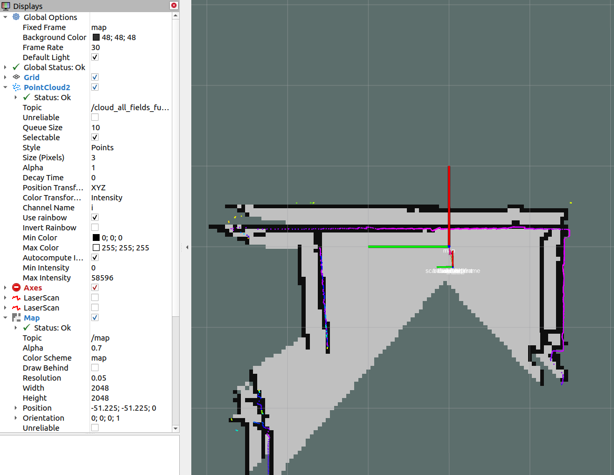
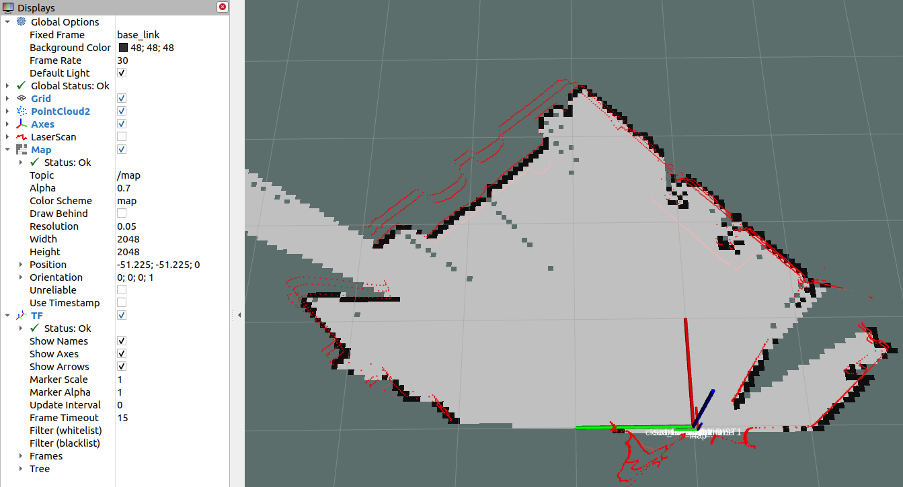

# Slam

## Table of contents

- [Introduction](#introduction)
- [Principle](#measuring-principle)
- [NAV-350 ROS-1 SLAM example](#nav-350-ros-1-slam-example)
- [NAV-350 ROS-2 SLAM example](#nav-350-ros-2-slam-example)
- [picoScan ROS-1 SLAM example](#picoscan-ros-1-slam-example)
- [MRS-1104 SLAM support](#mrs-1104-slam-support)
- [Google Cartographer](#google-cartographer)

## Introduction

In robotic mapping and navigation, simultaneous localization and mapping (SLAM) is the computational problem of constructing 
or updating a map of an unknown environment while simultaneously keeping track of an agent's location within it. 
For further details please refer to https://en.wikipedia.org/wiki/Simultaneous_localization_and_mapping.

## Measuring Principle

The following assumes that the SLAM algorithm works with a laser scanner mounted on a mobile base. The mobile base (e.g. a robot) records the environment while driving and creates the map from it. The mobile base usually has a so-called intertial measurement unit (IMU). In principle, however, it is also possible to estimate the direction of movement from the chronological sequence of the laser scans by means of correlation observations.
The laser scanner then virtually takes over the task of the IMU and other components (e.g. counting the wheel revolutions). The method of estimating the position and orientation (position estimation) of a mobile system based on data from its driving system is called odometry (cf. https://en.wikipedia.org/wiki/Odometry).

The SLAM algorithm hector_slam (http://wiki.ros.org/hector_slam) supports odometry estimation directly from the laser scans and is therefore used as a reference implementation in the following.

Other widely used SLAM algorithms such as gmapping (cf. http://wiki.ros.org/gmapping ) do not have this option. They depend on the data of an IMU. One possibility to use Gmapping nevertheless is the integration of the project laser_scan_matcher (https://answers.ros.org/question/63457/gmapping-without-odom/ and http://wiki.ros.org/laser_scan_matcher ).  Here, however, the pose must still be converted into an odometry message (see https://answers.ros.org/question/12489/obtaining-nav_msgsodometry-from-a-laser_scan-eg-with-laser_scan_matcher/ ).

## NAV-350 ROS-1 SLAM example

Build hector_slam and sick_scan_xd:
```
cd src
git clone -b master https://github.com/SICKAG/sick_scan_xd.git
git clone https://github.com/tu-darmstadt-ros-pkg/hector_slam.git
cd ..
catkin_make_isolated --install --cmake-args -DROS_VERSION=1 -DCMAKE_ENABLE_EMULATOR=1 -Wno-dev
```

Run rviz, sick_scan_xd with NAV-350 and hector_slam:
```
source ./devel_isolated/setup.bash
rosrun rviz rviz -d ./src/sick_scan_xd/test/emulator/config/rviz_slam_nav350.rviz &
roslaunch sick_scan sick_nav_350.launch hostname:=192.168.0.1 tf_publish_rate:=0 &
roslaunch sick_scan test_200_slam_ros1_hector.launch scan_topic:=/scan scan_layer_0_frame_id:=cloud_POS_000_DIST1 cloud_frame_id:=cloud &
```

**Note:** By default, sick_scan_xd publishes transform (TF) messages, which map frame id "map" to the point cloud frame id. To avoid conflicts with hector SLAM, it is recommended to disable these TF messages by commandline parameter **`tf_publish_rate:=0`** or by setting `<param name="tf_publish_rate" type="double" value="0"/>` in the launchfile.

The following rviz screenshot shows an example of a NAV-350 pointcloud created by sick_scan_xd and its map generated by hector_slam on ROS1:


## NAV-350 ROS-2 SLAM example

Install ths ROS2 slam-toolbox with `sudo apt install ros-foxy-navigation2 ros-foxy-nav2-bringup ros-foxy-slam-toolbox` (replace `foxy` by your ros distribution).

Build sick_scan_xd for ROS-2 as described in [INSTALL-ROS2.md](../INSTALL-ROS2.md)

Run rviz2, sick_scan_xd, slam_toolbox and static transforms:
```
source ./install/setup.bash
ros2 run rviz2 rviz2 -d ./src/sick_scan_xd/test/emulator/config/rviz2_slam_nav350.rviz &
ros2 launch sick_scan sick_nav_350.launch.py hostname:=192.168.0.1 tf_publish_rate:=0 &
ros2 run tf2_ros static_transform_publisher 0 0 0 0 0 0 base_link cloud  &
ros2 run tf2_ros static_transform_publisher 0 0 0 0 0 0 base_footprint base_link  &
ros2 run tf2_ros static_transform_publisher 0 0 0 0 0 0 odom base_footprint  &
ros2 launch nav2_bringup navigation_launch.py &
ros2 launch slam_toolbox online_async_launch.py &
```

Note: Laserscan messages need to be remapped to topic `/scan` (default is `/sick_nav_350/scan`). Use `remappings=[ ('/sick_nav_350/scan', '/scan'), ]` in the launchfile, e.g.:
```
node = Node(
    package='sick_scan',
    executable='sick_generic_caller',
    output='screen',
    remappings=[ ('/sick_nav_350/scan', '/scan'), ], # remap laserscan messages to topic /scan
)
```

The following rviz2 screenshot shows an example of a NAV-350 laserscan created by sick_scan_xd and its map generated by slam_toolbox on ROS2:


## picoScan ROS-1 SLAM example

Run rviz, sick_scan_xd with picoScan and hector_slam:
```
source ./devel_isolated/setup.bash
rosrun rviz rviz -d ./src/sick_scan_xd/test/emulator/config/rviz_slam_multiscan.rviz &
roslaunch sick_scan sick_nav_350.launch hostname:=192.168.0.1 hostname:=127.0.0.1 udp_receiver_ip:=192.168.0.100 tf_publish_rate:=0 &
roslaunch sick_scan test_200_slam_ros1_hector.launch scan_topic:=/sick_picoscan/scan_fullframe scan_layer_0_frame_id:=world_1 cloud_frame_id:=world &
```
Replace ip address `192.168.0.100` with the ip address of your local machine running sick_scan_xd.

The following rviz screenshot shows an example of a picoScan pointcloud created by sick_scan_xd and its map generated by hector_slam on ROS1:




## MRS-1104 SLAM support

MRS-1104 provides 4 layers covering elevation angles at -2.5°, 0.0°, 2.5° and 5.0°. The layer with 0.0° is used for SLAM by default. 

The following rviz screenshot shows an example of a MRS1104 pointcloud created by sick_scan_xd and its map generated by hector_slam on ROS1:



Since Hector-Slam expects only one laser scan frame with a unique identifier for the laser scans, the following parameters were added to the driver.

slam_echo: The name of the echo is entered here, which is filtered out of all possible 12 echoes. This should be "laser_POS_000_DIST1". This exports the first hit in the position with an elevation angle of 0°. If you want to use the layers with elevation angles -2.5°, 2.5° and 5.0°, you can set another flag with the name slam_bundle to True. If this flag is set, the oblique distances are multiplied by the cosine in this direction to obtain the projection onto the XY plane. This quadruples the number of points and increases the scan rate from 12.5 Hz to 50 Hz. However, for oblique impact surfaces (i.e. no vertical walls) this method can lead to larger estimation errors. In this case slam_bundle should be set to false.

## Google Cartographer


The support of Google Cartographer was made possible by a number of extensions to the driver. On the driver side, the MRS1104 is prepared to support the Google Cartographer. The Google Cartographer expects data packets at a high recording density (several hundred packets per second) to perform the SLAM algorithm. For this reason, an option has been introduced that allows the scans to be chopped into small angular ranges. The time stamps for these small ranges were converted accordingly. You can find results and further information [here](./google_cartographer.md)


